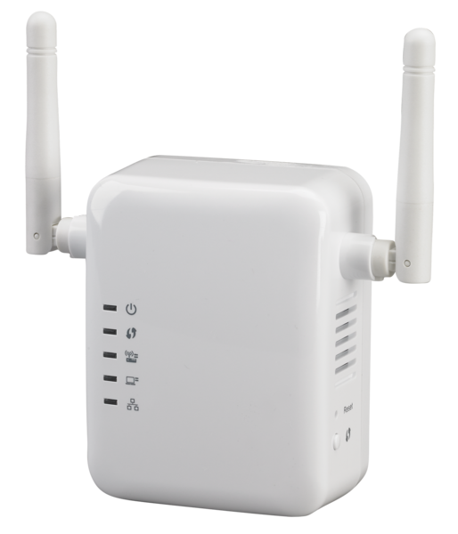
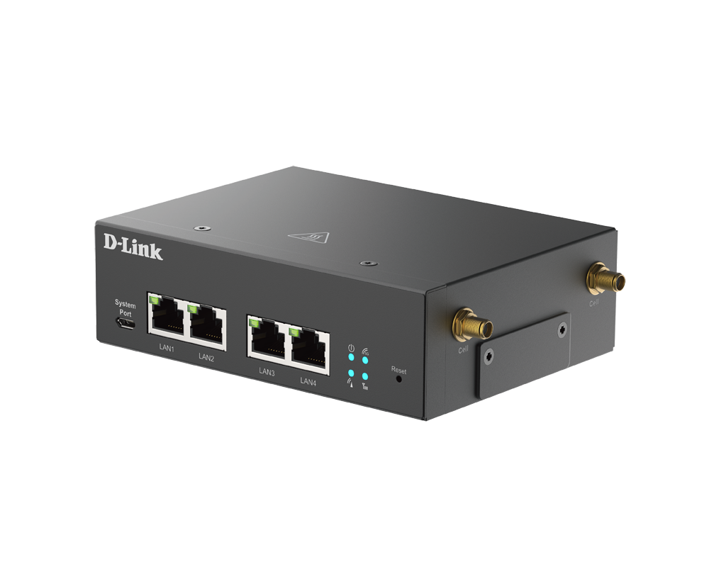
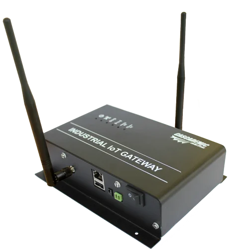
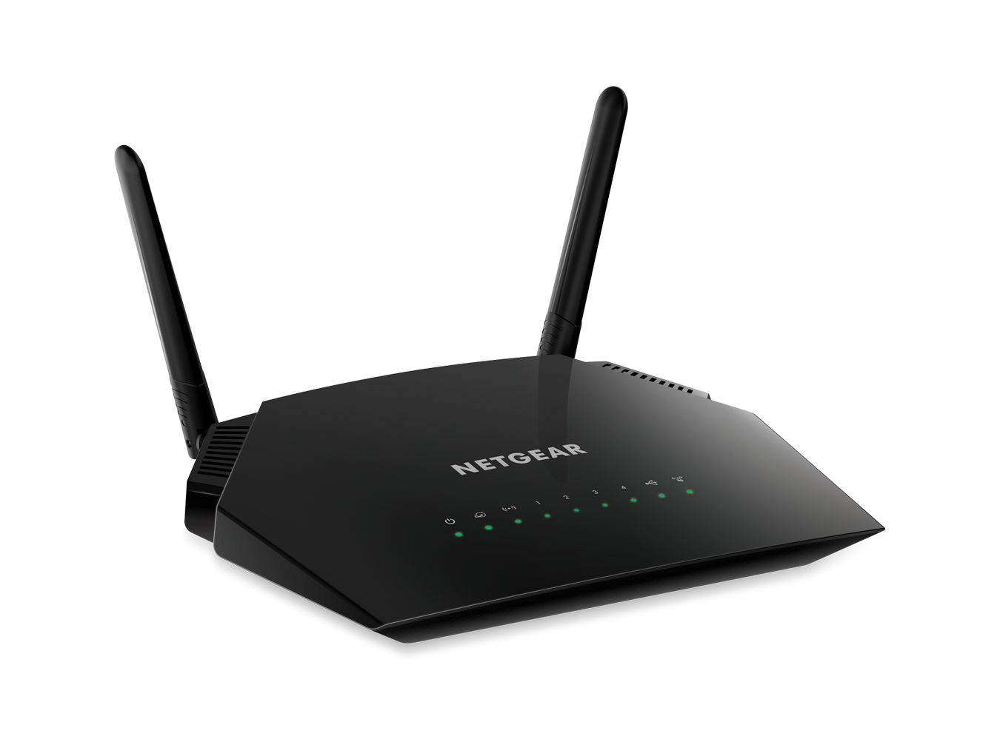
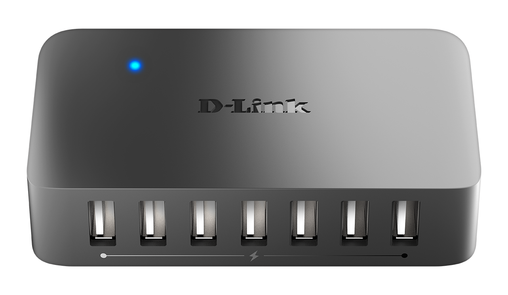
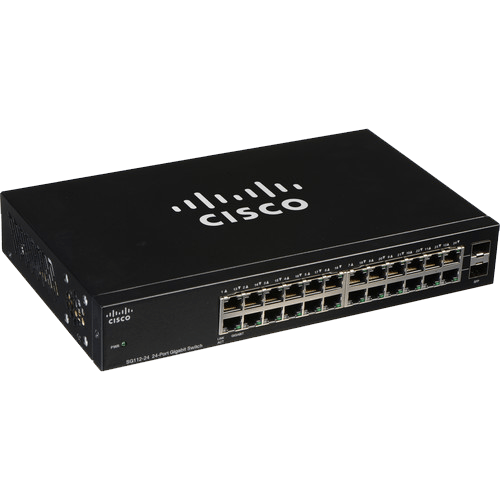
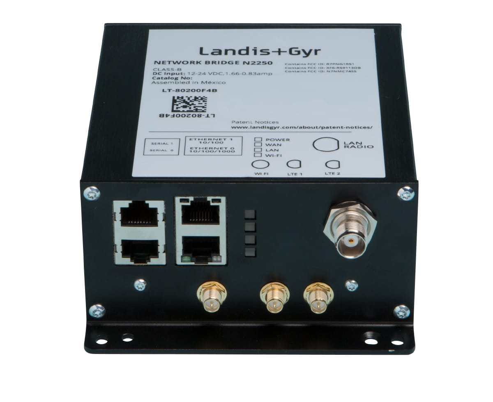

# Network Devices

There are lots of devices which are use to communicate with devices these devices\
called Networking Devices. There are **Internal**, **External** and **Portable** Devices.

**Internal Devices** :

* Network interface controller (NIC)
* Wireless Network Interface Controller
* Bluetooth Dongle

**External Devices**

* Hub
* Switches
* Routers
* Brouters
* Bridges
* Repeater
* Modem
* Gateway
* Wi-Fi-Routers or Broadband Routers

**Portable Devices**

* Wi-Fi Hotspot
* Portable Modem Dongle

Here are those devices in details:

1.  **Repeater** - Repeater is use to extend the range of radio signal so that the signal can cover longer distances. **A repeater is an electronic device that receives a signal and re transmits it**. **It does not amplify the signal**. Repeater is used for wired medium (example - telephone line repeater, fiber optical cable repeater etc.) as well as wireless medium (example - satellite repeater, microwave repeater, wi-fi repeater, LTE repeater etc.).

    **Types of Repeater**:

    * Analog Repeater
    * Digital Repeater
    * Microwave Repeater
    * Satellite Repeater
    * Wi-Fi Repeater | WLAN Repeater
    * LTE Repeater
    * Optical Repeater

    
2.  **Modems** - Modems are electronic devices which convert digital information of computers into analog signals and are also capable of again converting the analog signals to the digital information at the receiving end. Modems can be classified in various ways. Some of the common types include **half-duplex modem**, **full-duplex modem**, **2-wire modem**, **4-wire modem**, **synchronous** and **asynchronous modem**.\
    Modem stands for **Modulator and Demodulator device** which assists computer in transferring data and information over telephone lines. This is done by changing the **digital data into**\
    **analog signal** which can be transferred over the phone lines. In the receiver end, it again **converts the analog signal into the digital data**. Therefore simply, it acts as a modulator when it converts digital data into analog signal and it works as a demodulator when it converts analog signal to digital data.\
    There are modems having **Asymmetric digital subscriber line (ADSL)** and some not supporting ADSL (identified with DSL led blinker on panel).

    **Types of Modems :**

    * based on location
      * Onboard Modem
      * Internal Modem
      * External Modem
      * Removable Modem
    * based on its working
      * Half duplex Modem
      * Full Duplex Modem
      * 2 wire modem
      * 4 wire modem
      * Synchronous Modem
      * Asynchronous Modem

    
3.  **Gateway** - A gateway is not a hardware device. It is **software firmware** which saves the **configuration setting of a device**. Mostly the gateway address in routers is **192.168.0.1** or **192 168.1.1**.\
    Its acts as a "**gate**" between two networks. It may be a router, firewall, server, or other device that enables traffic to flow in and out of the network. While a gateway protects\
    the nodes within network, it itself is also a node.

    
4.  **WIFI-Routers** - Similar to a modem with the additional feature of Wireless connectivity called as "WIFI ".It generally has 4 ethernet ports and it is having routing DHCP to connect 240 pc and devices providing internet with wired and wireless options.

    <figure><figcaption>
Wi-Fi Router
</figcaption></figure>
5.  **Hubs** - It is basically a multiport hub. A hub is a device to which all the devices sharing a physical network can be physically connected to form a "Local Area Network" or "LAN". Hubs enable the electric currents from a computer to pass to all other devices connected to it. Since a hub was the electronic equivalent of shouting in a room as necessary, as the number of devices increased, the number of collisions increased and LAN performance ground to a hault. In a hub-centric environment, the message packets being sent by each device that is connected to the hub can be "seen" by every other\
    device on the hub whether they are involved in the conversation or not. So, hubs can facilitate message eavesdropping.

    **Types of Hub** :

    * **Active Hub** :- These are the hubs which **have their own power supply** and can **clean , boost and relay the signal** along the network. It serves **both as a repeater as well as wiring center**. These are used to **extend maximum distance between nodes**.
    * **Passive Hub** :- These are the hubs which **collect wiring from nodes** and **power supply from active hub**. These hubs **relay signals** onto the network **without cleaning and boosting them** and **can't be used to extend distance between nodes**.
    * **Intelligent Hubs** :- An intelligent hub can help in **troubleshooting by pinpointing** the actual location of the problem and help **identify the root cause and resolution**. It is **very adaptable to different technologies without any need to change its configuration**. The intelligent hub performs different functions such as **bridging, routing, switching and network management**.

    
6.  **Switches** - A switch serves as a controller, enabling networked devices to talk to each other\
    efficiently. A switches use to connect computers, printers, phones, cameras, lights, and servers in a building or campus.

    **Types of Switches** :

    * **Unmanaged switches** :- An unmanaged switch works right out of the box. It's not designed to be configured. so you don't have to worry about installing or setting it up correctly. Unmanaged switches have fewer features and less network capacity than managed switches. You'll usually find unmanaged switches in home networking equipments.
    *   **Managed switches** :- A managed network switch is configurable, offering greater security, flexibility and capacity than an unmanaged switch. You can monitor and adjust a managed switch locally or remotely, to give you greater network control.

        
7.  **Routers** - When a device in a Local Area Network needs to communicate with a device on another LAN, it must send that traffic to a specialized device connected to the LAN called a "router" whose purpose is to find the best path for the message to take to arrive at the intended target device, and to send the message along its way following that path.

    In order to allow the billions of devices on the Internet to find each other, routers regularly need to communicate among themselves using protocols that enable them to share routing information so that, when a device needs to send a communication message to a target device, the routers work together to determine the best path for the message packet to use to arrive at the intended target device.

    Each router port is configured with a specific routing protocol that is associated with that port's function. For example, a router port that connects to the Internet must learn how to efficiently route communication messages to destinations around the world. Protocols that facilitate this are called **"gateway routing protocols"** and have names such as the **Border Gateway Protocol ("BGP")** or **Exterior Gateway Protocol ("EGP")**. A router port that connects to an organization's internal networks must learn how the organization's network is configured to efficiently route traffic throughout the organization. Protocols that serve this purpose are called **"interior routing protocols"** and have names such as **Enhanced Interior Gateway Routing Protocol ("EIGRP")**, **Interior Gateway Routing Protocol ("IGRP")**, **Open Shortest Path First (OSPF")**, **Routing Information Protocol I and II ("RIP" /"RIP II")**, etc.

    **Types of Routers** :

    * Broadband Routers
    * Wireless Routers
    * Edge Router
    * Subscriber Edge Router
    * Inter-provider Border Router
    * Core Router

    
8.  **Brouter** - It is also known as bridging router which is a device which combines features of both bridge and router. It can work either at data link layer or at network layer. Working as router, it is capable of routing packets across networks and working as bridge, it is capable of filtering local area network traffic.

    A bridge router or brouter is a network device that works as a bridge and as a router. The brouter routes packets for known protocols and simply forwards all other packets as a bridge would.

    Brouters operate at both the network layer for routable protocols and at the data link layer for non-routable protocols. As network continue to become more complex, a mix of routable and non-routable protocols has led to the need for the combined features of bridges and routers.Brouters handle both routable and non-routable features by acting as routers for routable protocols and bridges for non-routable protocols.
9.  **Bridge** - A network bridge device is primarily used in local area networks because they can potentially flood and clog a large network, thanks to their ability to broadcast data to all the nodes if they don't know the destination node's MAC address.

    A bridge is a type of computer network device that provides interconnection with other bridge networks that use the same protocol.

    Bridge devices work at the data link layer of the Open System Interconnection (OSI) model, connecting two different networks together and providing communication between them. Bridges are similar to repeaters and hubs in that they broadcast data to every node. However, bridges maintain the Media Access control (MAC) address table as soon as they discover new segments, so subsequent transmission are sent only to the desired recipient.

    A bridge uses a database to ascertain where to pass, transmit or discard the data frame.

    1. If the frame received by the bridge is meant for a segment that resides on the same host network, it will pass the frame to that node and the receiving bridge will then discard it.
    2. If the bridge receives a frame whose node MAC address is of the connected network, it will forward the frame toward it.

    <figure><figcaption>
Network Bridge
</figcaption></figure>
