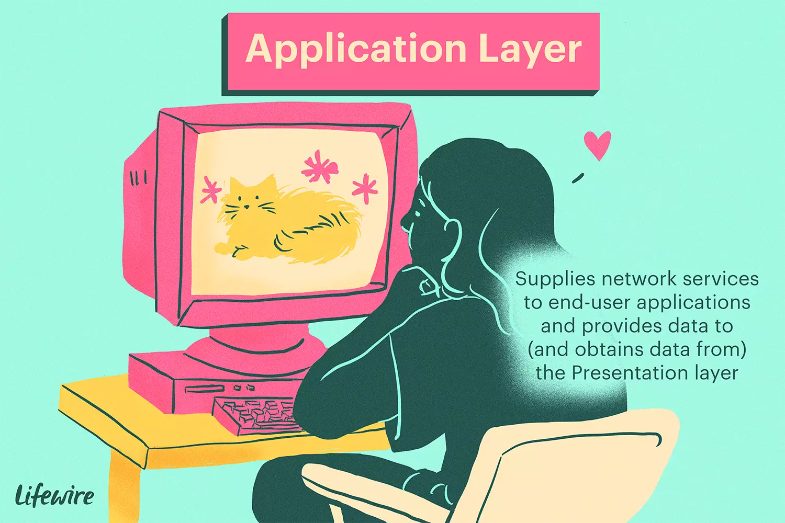

# OSI Model

The OSI Model stands for Open Systems Interconnection Model. It was developed as a standard of how people and computers interact. There are 7 layers in the OSI Model:

*   **Application Layer** - It is implemented in software. Users will send the data to the software in this layer. Protocols used here include HTTP, FTP, Telnet etc. 

    <figure><figcaption>
Source: LifeWire's "The Layers of the OSI Model Illustrated" article
</figcaption></figure>
*   **Presentation Layer** - The data is translated into machine representable binary code. This is known as **translation**. The data goes under encoding, compression and encryption. It also provides abstraction. Here, SSL (Secure Socket Layer) protocol is used.

    <figure><figcaption>
Source: LifeWire's "The Layers of the OSI Model Illustrated" article
</figcaption></figure>
*   **Session Layer** - The Session Layer helps in setting up and managing the connections. It enables the sending and receiving of data followed by termination of connected sessions. Authentication is done in this layer. Then, authorization (Checking whether you have the permission to access any resource on the server) is done. 

    <figure><figcaption>
Source: LifeWire's "The Layers of the OSI Model Illustrated" article
</figcaption></figure>
*   **Transport Layer** - UDP and TCP Protocol is used in this layer. The transport layer transports the data in three ways:

    * **Segmentation:** The data received from the session layer, is segmented. Every segment of the data will contain the sender's and receiver's port numbers, and the sequence numbers. Sequence number helps to reassemble the data in the correct order.
    * **Flow Control:** The transport layer controls the amount of data that is transmitted.
    * **Error Control:** It checks whether the data is corrupted or missing or not using **checksums** attached to each data packets.

    **Connection-oriented service** and **connectionless service** takes place at the **receiver's end** in this layer. 

    <figure><figcaption>
Source: LifeWire's "The Layers of the OSI Model Illustrated" article
</figcaption></figure>
*   **Network Layer** - It is responsible for the transmission of the data from one computer to another computer that is located in a different network. Here, router is present. The function of network layer is **Logical addressing**. Logical addressing is the assigning of sender's and receiver's IP Address to each of the data segments, and it forms an **IP Packet**, so that all the data packets can reach the correct destination. It performs **routing** which is the movement of the data packet from source to destination. Load balancing also happens here. 

    <figure><figcaption>
Source: LifeWire's "The Layers of the OSI Model Illustrated" article
</figcaption></figure>
*   **Data Link Layer** - It helps to directly communicate with the computers. Physical Addressing happens here. It is the assigning of MAC Address of the sender and receiver's device to the data packets, forming **frames**. MAC address is a 12-digit alphanumeric number of the network interface of your device. It also controls how the data is received using Media Access Control. 

    <figure><figcaption>
Source: LifeWire's "The Layers of the OSI Model Illustrated" article
</figcaption></figure>
*   **Physical Layer** - This is the hardware layer which transports the data through wires to the receiver. 

    <figure><figcaption>
Source: LifeWire's "The Layers of the OSI Model Illustrated" article
</figcaption></figure>

<figure><figcaption>
OSI Model
</figcaption></figure>
