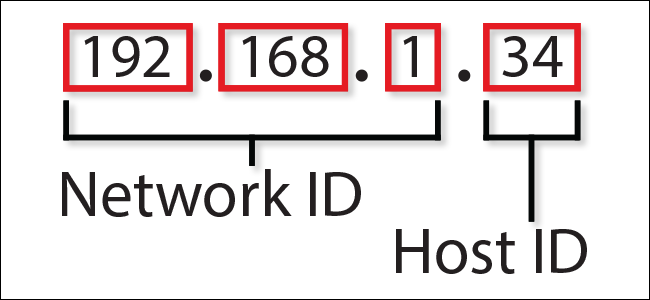

# Network Layer

In this layer, we work with routers. This layer helps in the data transmission from source to destination. The **routing table** is a table inside the router containing information about the topology of the network immediately around it. The data packet will contain the data along with the source network layer address. The router checks whether the data is for a device connected to it or not. If not, then the router checks its **forwarding table (Or MAC Table)** to find in which direction and to which router the data should go. This goes on until the data receives the correct router. This is called **hop-by-hop** architecture. This hoping happens at ISPs. Routing table contains multiple paths, whereas forwarding table contains one path, thus it's faster. Every router has its own network addresses or Logical addresses.

*   _**Parts Of IP Addresses**_\
    Here, the Network ID also known as Network address, tells which network your device resides in. The Host ID is the part of an IP address that uniquely identifies a specific host on a given TCP/IP network.

    <figure><figcaption></figcaption></figure>
* _**Control Plane**_ - Control plane is used to create the routing tables. **Control Plane is like a very big graph** in which the **nodes are the routers,** and the **edges are the links between routers**. Two types of routing are used to create routing tables:
  * **Static Routing** - Addresses are added _**manually**_. This is time consuming and not adaptable easily.
  * **Dynamic Routing** - If there is a change in the addresses or network, addresses are modified _**automatically**_. Algorithms used here include Bellman-Ford algorithm, Dijkstra's algorithm, etc.
*   **Subnetting**

    Here, the Network ID is the subnet ID. All the devices connected to that router having that subnet ID, will have the same subnet IDs and differ only in Host IDs.

<figure><figcaption></figcaption></figure>

* _**Class Of IP Addresses**_ - There are five classes (basically denoting a range of IP addresses) of IP Addresses:
  * _**Class A**_ - from **0.0.0.0** to **127.255.255.255**
  * _**Class B**_ - from **128.0.0.0** to **191.255.255.255**
  * _**Class C**_ - from **192.0.0.0** to **223.255.255.255**
  * _**Class D**_ - from **224.0.0.0** to **239.255.255.255**
  * _**Class E**_ - from **240.0.0.0** to **255.255.255.255**
* _**Subnet Masking**_ - It means that the **subnet mask** is going to mask the network ID and leave the host ID for us to use. **Variable length subnets** mean that you can set your own length of the subnet ID. [The Internet Engineering Task Force (IETF)](https://www.ietf.org/) assigns the IP Addresses to the **ISP** without thinking of the classes of IP Addresses but **based on REGIONS**.
* _**Reserved IP Addresses**_ - 127.0.0.0/8 means that the first 8 bits are reserved, the rest can be used. This are known as **loopback addresses** as the processes which are running on the same machine will allow us to contact the same processes, i.e, our computer acts both as a server and a client at the same time. _Example_: Localhost (127.0.0.1). You can have as many numbers of loopback addresses as you want.
*   _**Middle Boxes**_ - This are devices that comes in between router and system endpoint and interact with the data packets. This can be present in network layer or even at transport layer. Example: **Firewall** and **NAT**.

    * **Firewall** - Two types are there - One connected to the global internet and the other connected to your own network. The packets coming to the network can be filtered and even modified (the headers and the destination can also be changed), flags can also be checked. There are stateless and stateful firewalls (uses cache so it's much faster).
    * **NAT (Network Address Translation)** - [Network address translation (NAT)](https://en.wikipedia.org/wiki/Network_address_translation) is a method of mapping an IP address space into another by modifying network address information in the IP header of packets while they are in transit across a traffic routing device. It is done to slow down the consumption of IP Addresses.

    <figure><figcaption></figcaption></figure>

    &#x20;
*   _**Network Layer Protocols**_:&#x20;

    The protocols used by network layer are -

    *   **IP (Internet Protocol (IPv4))** - IPv4 is a network layer protocol that contains **addressing and control information**, which helps packets be routed in a network. **IP works in tandem with TCP** to deliver data packets across the network. Under IP, each host is assigned a _**32-bit**_ address comprised of two major parts: **the network number and host number**. The **network number identifies a network and is assigned by the internet, while the host number identifies a host on the network and is assigned by a network admin**. The **IP is only responsible for delivering the packets, and TCP helps puts them back in the right order.**

        IPv4 data packets has headers (IP Version, identification numbers, length of data, checksum, addresses, TTL (time to leave), etc.) of 20 bytes apart from the data. If TTL (time to leave) is crossed and the data acknowledgement does not return, the packet will be dropped.

        **Advantages:**\
        1\. IPv4 encrypts data to ensure privacy and security.\
        2\. With IP, routing data becomes more scalable and economical.\
        **Disadvantage:**\
        IPv4 is labor intensive, complex, and prone to errors.
    *   **IPv6 (Internet Protocol version 6)** - IPv6 is the latest version of the Internet Protocol, a network layer protocol that possesses addressing and control information for enabling packets to be routed in the network. IPv6 was created to deal with IPv4 exhaustion. It increases the **IP address size from 32 bits to 128 bits** to support more levels of addressing.

        _There are 8 numbers in the IPv6, and each number is a hexa-decimal number and is of 16 bits._

        **Advantages:**\
        1\. More efficient routing and packet processing compared to IPv4.\
        2\. Better security compared to IPv4.\
        **Disadvantages:**\
        1\. IPv6 is not compatible with machines that run on IPv4.\
        2\. Challenge in upgrading the devices to IPv6.
    *   **ICMP (Internet Control Message Protocol)** - ICMP is a network layer supporting protocol used by network devices to **send error messages and operational information**. _**ICMP messages delivered in IP packets are used for out-of-band messages related to network operation or misoperation**_. ICMP is used to **announce network errors, congestion, and timeouts, as well assist in troubleshooting.**

        **Advantage:**\
        ICMP is used to diagnose network issues.\
        **Disadvantages:**\
        1\. Sending a lot of ICMP messages increases network traffic.\
        2\. End users are affected if malicious users send many ICMP destination unreachable packets.
