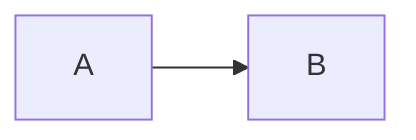
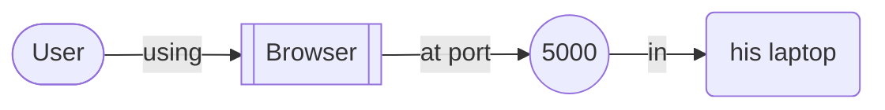
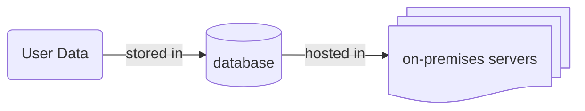
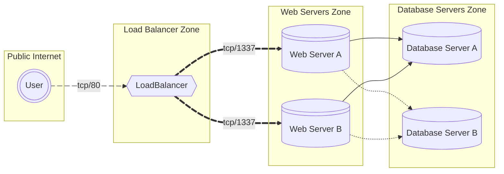

# Flowchart

Flowcharts contain **nodes** (the geometric shapes) and **edges** (the arrows or lines). They are ideal for visualizing simple processes directly in markdown.

For example, a user login flow can be clearly mapped out to show steps like entering credentials, checking validity, and redirecting to the dashboard. This helps both developers and stakeholders quickly understand logic without external tools.

### Orientation

Possible flowchart orientations:

* TB/TD: Top to Bottom
* BT: Bottom to Top
* RL: Right to Left
* LR: Left to Right

### Node shapes

### Subgraph

Subgraphs are especially useful when inter-connected graphs are shown in one frame.

In the above example, different node shapes and subgraphs have been used along with node IDs (like `e1`, `e2`, `e3`, etc.). By using those IDs, we can animate them using `{animate: true}`.

### Want to Know More?

If you're interested in learning more, the full content is available here: [https://mermaid.js.org/syntax/flowchart.html](https://mermaid.js.org/syntax/flowchart.html)
