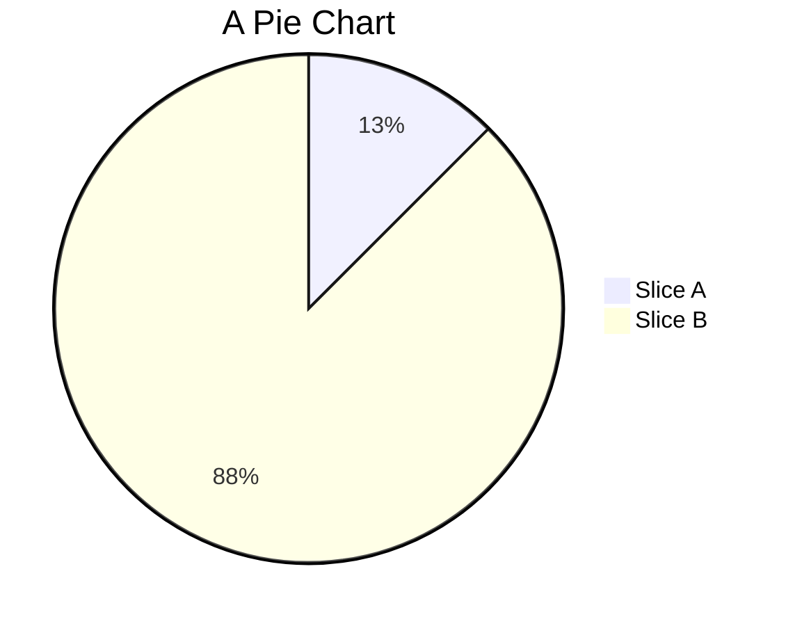

# Pie Chart

Pie charts are very simple and easily depicted using mermaid. Here's a simple example:

### Want to Know More?

If you're interested in learning more, the full content is available here: [https://mermaid.js.org/syntax/pie.html](https://mermaid.js.org/syntax/pie.html)
