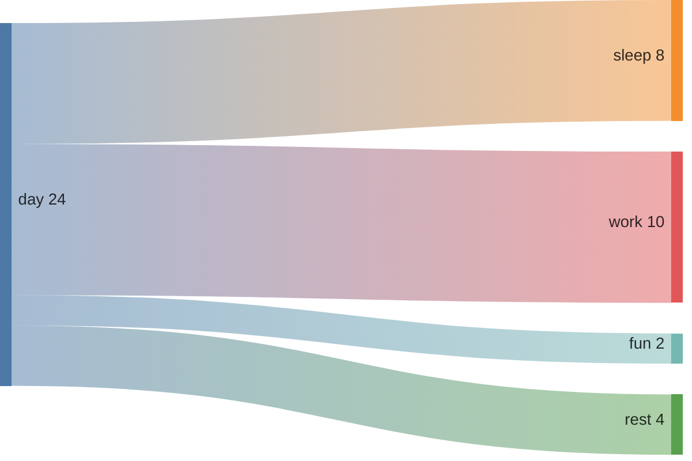

# Sankey

Sankey is used to depict flow from one data to another. Here's a simple example:

### Want to Know More?

If you're interested in learning more, the full content is available here: [https://mermaid.js.org/syntax/sankey.html](https://mermaid.js.org/syntax/sankey.html)
